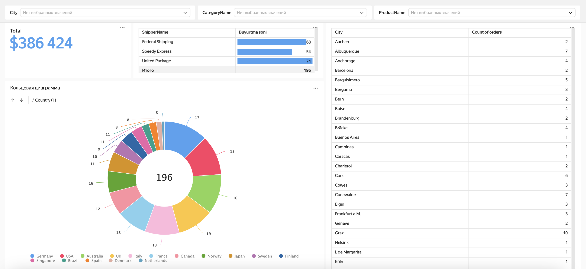
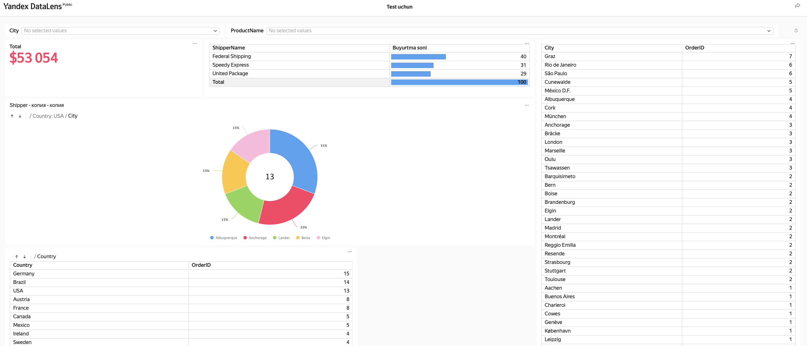
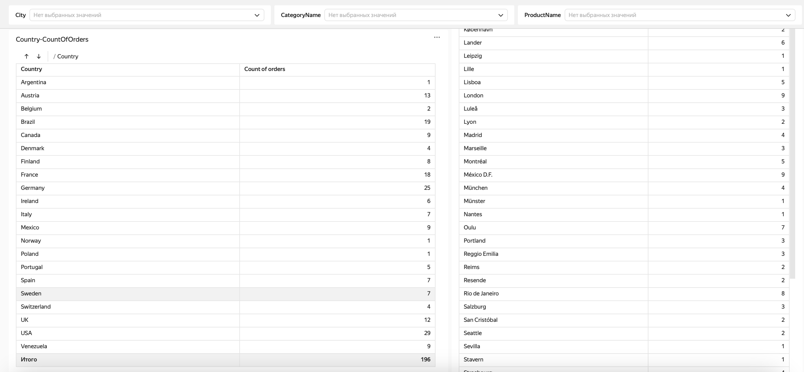

## 📊 Order Statistics Dashboard on Yandex Datalens

This repository contains a dashboard that visualizes order statistics, including total revenue, shipment distribution, and geographical data.

🔗 **Live Repository:** [Order Statistics on Yandex Datalens](https://datalens.yandex.cloud/hbh0vgwjawki3)

### 📊 Dashboard Overview  

#### English 🇬🇧  
This dashboard provides a visual representation of order statistics.  

- **Total Revenue:** $386,424  
- **Order Distribution by Shipper:**  
  - Federal Shipping: 68 orders  
  - Speedy Express: 54 orders  
  - United Package: 74 orders  
- **Geographical Distribution:**  
  - The donut chart displays order distribution by country.  
  - The table on the right shows order counts per city.  
- **Filters:**  
  - Users can filter data by **City, Category, and Product Name**.  

---

#### Русский 🇷🇺  
Этот дашборд предоставляет визуальное представление статистики заказов.  

- **Общий доход:** $386 424  
- **Распределение заказов по перевозчикам:**  
  - Federal Shipping: 68 заказов  
  - Speedy Express: 54 заказа  
  - United Package: 74 заказа  
- **Географическое распределение:**  
  - Кольцевая диаграмма показывает распределение заказов по странам.  
  - Таблица справа отображает количество заказов по городам.  
- **Фильтры:**  
  - Пользователи могут фильтровать данные по **городу, категории и названию продукта**.  

---

#### Oʻzbek 🇺🇿  
Ushbu dashboard buyurtmalar statistikasi bo‘yicha vizual ma’lumot beradi.  

- **Jami daromad:** $386,424  
- **Tashuvchilarga ko‘ra buyurtmalar:**  
  - Federal Shipping: 68 ta buyurtma  
  - Speedy Express: 54 ta buyurtma  
  - United Package: 74 ta buyurtma  
- **Geografik taqsimot:**  
  - Diagrammada buyurtmalar mamlakatlar bo‘yicha taqsimlangan.  
  - O‘ng tomonda joylashgan jadval shaharlar bo‘yicha buyurtmalar sonini ko‘rsatadi.  
- **Filtrlar:**  
  - Foydalanuvchilar **shahar, kategoriya va mahsulot nomi** bo‘yicha ma’lumotlarni filtrlashi mumkin.  

